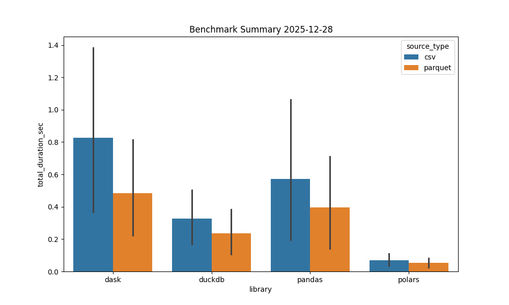

# ETL Performance & Design Patterns Research

> **🎯 Project Purpose**
>
> This repository aims to **establish an experimental foundation** for benchmarking various data processing libraries and investigating **Design Patterns** applied to ETL processes within the **KDD (Knowledge Discovery in Databases)** framework.
>
> **⚠️ Note on Scope**: The `my_etl_framework` included here serves primarily as a base to demonstrate **how to create, structure, and deploy Python libraries**. Developing a truly engine-agnostic ETL library that intelligently selects the best processor for every workload involves significant complexity, time, and architectural reflection. Consider this project a **Proof of Concept (PoC)** that could serve as the seed for a specific, dedicated project in the future.

---

## 🚀 Technical Implementation: Multi-Engine ETL Framework

From a technical perspective, this project implements an **Engine-Agnostic ETL Framework** that allows users to define data transformations once and execute them using multiple high-performance data libraries: **Pandas, Polars, DuckDB, and Dask**.

---

## 🚀 Key Features

*   **Engine Agnostic**: Switch between `pandas`, `polars`, `duckdb`, or `dask` by changing a single config string.
*   **Format Flexibility**: Full support for **CSV, Parquet, and JSON** inputs/outputs effectively across all engines.
*   **Business Logic decoupling**: Define *what* to do (Metadata/Rules) separate from *how* to do it (Implementation).
*   **Performance Benchmarking**: Includes a full suite to stress-test your data pipeline against different engines.
*   **Observability**: Built-in performance monitoring (Time & Memory).

---

## 📦 Installation

This framework is packaged as a standard Python library.

### 1. Requirements
*   Python 3.10+
*   Virtual Environment (recommended)

### 2. Install
```bash
# Create venv
python -m venv .venv
source .venv/bin/activate

# Install dependencies (Streamlit, Plotly, etc.)
pip install -r requirements.txt

# Install the library in editable mode
pip install -e .
```

---

## 🛠️ Usage (Library)

You can use `my_etl_framework` in any Python script or Airflow DAG.

```python
from etl_framework.etl_factory_provider import ETLFactoryProvider
from etl_framework.etl_processor import ETLProcessor
from etl_framework.utils.monitoring import PerformanceMonitor

# 1. Define Business Rules (Data Contract)
class CustomerTransactionsLogic:
    """
    Defines the Schema and Business Rules for the dataset.
    This acts as a 'Source of Truth', decoupled from the execution engine.
    """
    def get_attributes(self):
        """Defines the expected column schema"""
        return [
            'transaction_id', 
            'customer_name', 
            'transaction_date', 
            'amount', 
            'category'
        ]

    def get_types(self):
        """Defines strict data types for validation/casting"""
        return {
            'transaction_id': int,
            'customer_name': str,
            'transaction_date': 'datetime',
            'amount': float,
            'category': str
        }

    def get_rules(self):
        """
        Maps attributes to specific transformation strategies.
        These abstract names (e.g., 'impute_mean') are implemented 
        optimizedly in each specific library (Pandas, Polars, etc).
        """
        return {
            'customer_name': 'capitalize_first_letter',  # Standardization
            'amount': 'impute_mean',                     # Data Cleaning
            'transaction_date': 'days_since',            # Feature Engineering
            'category': 'fill_unknown'                   # Handling Missing Data
        }

# 2. Select Engine ('polars', 'duckdb', 'pandas', 'dask')
ENGINE = 'polars'

# 3. Instantiate Factory & Processor with the Business Logic
metadata = CustomerTransactionsLogic()
factory = ETLFactoryProvider.get_factory(ENGINE, metadata)
processor = ETLProcessor(factory, ENGINE, monitor=PerformanceMonitor())

# 4. Run Pipeline with specific Execution Parameters
processor.process(
    source_type='csv',
    extractor_params={'file_path': 'data/input_transactions.csv', 'separator': ';'},
    destination_type='parquet',
    loader_params={'output_path': 'data/processed_transactions.parquet'},
    
    # We apply the rules defined in our Metadata contract
    transformations={
        'attributes': {
            'customer_name': ['capitalize_first_letter'],
            'amount': ['impute_mean'],
            'transaction_date': ['days_since']
        }
    }
)
```

---

## 📊 Benchmarking Dashboard

This repository includes a powerful Streamlit Dashboard to compare engine performance.

### Running the Dashboard
```bash
streamlit run dashboard.py
```

### Features
1.  **Configuration**: GUI to select Libraries, Input/Output formats, and Data Size.
2.  **Execution**: Runs real benchmarks in the background.
3.  **Analysis**:
    *   Compare **Execution Time** vs **Memory Usage**.
    *   Analyze breakdown by phase (Setup, Extract, Transform, Load).
    *   **Save Reports**: Export interactive HTML charts of your results.
4.  **🤖 Generative AI Analysis**:
    *   Uses **Google Gemini 2.5 Flash** (via LangChain) to analyze benchmark data.
    *   Automatically generates an **Executive Report** summarizing "Winners", "Scalability", and "Recommendations".
    *   Updates this `README.md` file dynamically with the latest insights.

---

## 📂 Project Structure

```
├── my_etl_framework/       # Core Library (Main Package)
│   ├── etl_factory_provider.py
│   ├── etl_processor.py
│   ├── library_*/          # Engine implementations (Strategies)
│   └── utils/              # Monitoring & Helpers
├── dashboard.py            # Streamlit GUI App
├── benchmark_etl.py        # CLI Benchmarking Script
├── examples/               # Usage Examples
│   └── etl_pipeline_demo.py    
├── experiments_results/    # Folder for benchmark artifacts & logs
├── setup.py                # Pip package configuration
└── requirements.txt        # Dependencies
```

## ⚙️ Configuration Architecture

The framework uses a decoupled configuration approach to separate **Infrastructure** from **Data Definitions**.

### 1. Library Capabilities (`config/library_manifest.yaml`)
Acts as a static catalog of what the framework *can* do. Useful for UI tools and validations.

> **⚠️ MAINTENANCE NOTE**: This file is the source of truth for the library's capabilities. **It must be updated** whenever a new version is released, a new engine is supported, or a new transformation function is implemented in the code.

```yaml
capabilities:
  supported_engines: [pandas, polars, duckdb, dask]
  transformation_catalog:
    - name: "impute_mean"
      type: "Numeric -> Numeric"
      description: "Fills missing values with mean."
```

### 2. Experiment & Data Contract (`config/experiment_matrix.yaml`)
Defines the runtime parameters and the specific schema of your dataset.

**A. ETL Experiment (Runtime)**
```yaml
etl:
  libraries: [ 'polars', 'duckdb' ]
  rows_limit: 100000
  transformations:
    attributes:
        price: [ 'impute_mean' ] # References a function from the Manifest
```

**B. Dataset Metadata (Source of Truth)**
```yaml
metadata:
  attributes: ['transaction_id', 'price']
  types:
    price: float
  rules:
    price: impute_mean
```

## 🏗️ Design Patterns

*   **Abstract Factory**: Decouples the client from specific ETL implementations (e.g., `PolarsETLFactory`).
*   **Strategy**: Encapsulates transformation algorithms (`PandasImputeMeanTransformer`, `DuckDBImputeMeanTransformer`).
*   **Dependency Injection**: Injects Metadata and Monitors into the processor for better testing and isolation.


<!-- START_GLOBAL_RESULTS -->
## 📊 Latest Results (2025-12-28)

### AI Summary
As a Principal Data Architect, I've thoroughly analyzed the provided ETL benchmark data across different libraries (Dask, DuckDB, Pandas, Polars) and data sources (CSV, Parquet) for varying file sizes. This report summarizes the key findings and provides strategic recommendations for your data architecture decisions.

---

## ETL Benchmark Analysis: Executive Report

### 1. 🚀 Executive Summary

The clear winner in this benchmark, demonstrating superior overall performance across both speed and efficiency for in-memory processing, is **Polars**. It consistently delivered the fastest execution times, particularly with Parquet data.

**Main Insights:**
*   **Polars Dominance**: Polars is the top performer for speed, making it an excellent choice for modern, high-performance ETL workloads.
*  ...
[Full Report](global_analysis/report_2025-12-28.md)
<!-- END_GLOBAL_RESULTS -->